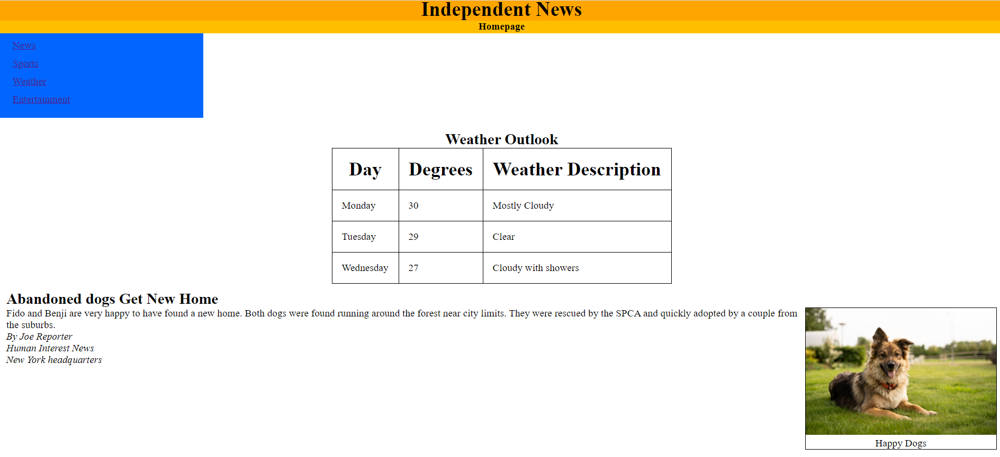

# Creating a HTML5 Basic Layout 

## Task 1: Setting up the Basic Layout of the Homepage

You have already set up an HTML5 web page for your News home page. You want to set up the basic layout of the page by defining different parts using non-semantic elements such as `<div>`, `<span>`, `<ul>`, and `<table>` and a few semantic elements such as `<header>` and `<nav>` elements. You need to add code so that your page structure reflects these elements.

Complete the exercise in the following steps:

1. Create a header for the name of your site which is "Independent News". &#9745;
2. Create DIV containers for the header and give it a background color of orange. &#9745;
3. Create a nested DIV container within the "Independent News" DIV container that contains the words "Homepage" and give it a background color of another shade of orange. &#9745;
4. Set up another div container to hold a navigation menu. &#9745;
5. Add the navigation system to the DIV by using an unordered list that has "News", "Sports", "Weather", and "Entertainment" as navigation links. &#9745;
6. Create a table with headers and three rows to display Weather information. Use the following information: 
     - Monday – 30 – mostly cloudy &#9745;
     - Tuesday – 29 – clear &#9745;
     - Wednesday – 27 – cloudy with showers &#9745;
7. Specify dimensions to the three divs you created using the values of your choosing, which contribute to an intuitive layout. &#9745;

## Task 2: Add additional semantic elements to your Basic Layout

1. Format the navigation area so that it has a background color of blue, a width of 300px, and so that the bullets are removed. &#9745;
2. After the weather information, create an article using the information below. Provide the code to ensure there is a separate heading and area for the story itself.
   ```
   Abandoned Dogs Get New Home
   
   Fido and Benji are very happy to have found a new home. Both dogs were found running around the forest near city limits. They were rescued by the SPCA and quickly adopted by a couple from the suburbs.
   ```
3. For the article created in Step 2, add a Section that contains the author's information below and provide the code to categorize and define the author of the article.
   ```
   By Joe Reporter

   Human Interest News

   New York headquarters
   ```
4. Add the image dogs.JPG to the article and provide the code to categorize it as a figure.
5. For the figure created in Step 4, add the figure caption information below using the correct code.
   ```
   Happy Dogs
   ```
6. Provide the code necessary to put a border around the Figure and Figure Caption from Steps 4 and 5 and to make the Figure reside on the right side of the story information in the article.

## The basic layout website...

